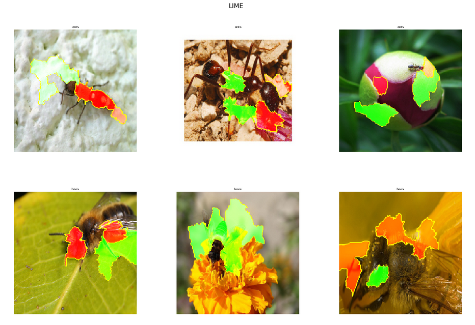
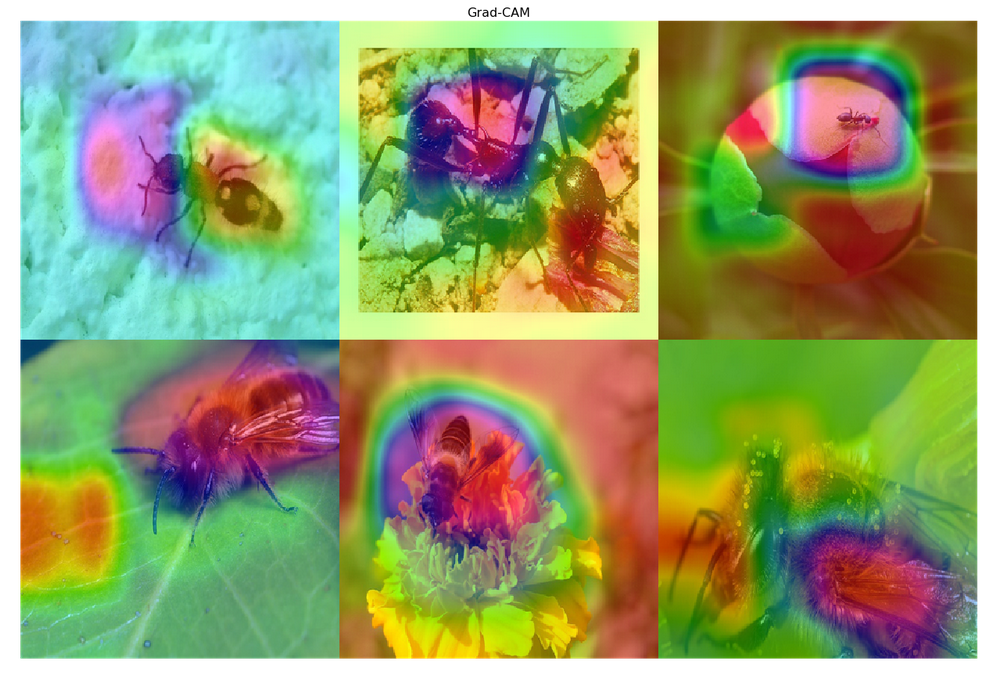
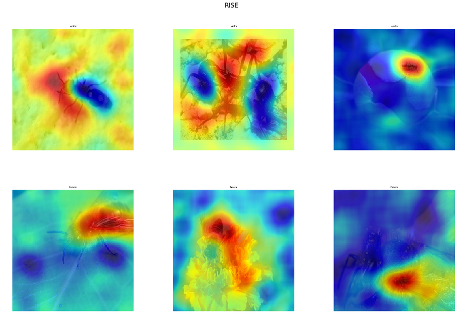

This is a repository with code used in
`"Machine learning for expert-level image-based identification of very similar species in the hyperdiverse plant bug family Miridae (Hemiptera: Heteroptera)"` 
article.\
The model training experiments were based on PyTorch neural networks framework.

---
Most of essential parameters are placed in `config.py`. For example:

* `DATASETS_LIST`: the list of defined datasets for training experiments.

* `MODELS_LIST`: list of possible models for training. 

Available models out-of-the-box from the repo:

['resnet18', 'resnet34', 'resnet50', 'resnet101', 'resnet152',
'wide_resnet50_2', 'wide_resnet101_2', 'resnext50_32x4d', 'resnext101_32x8d',
'mobilenet_v2', 'mobilenet_v3_large'
               ]

* `IMBALANCED_TOOL_LIST`: list of possible tools for class-imbalance problem.

Available tools out-of-the-box: 
['weighted_loss', 'train_sampler', 'default']

---
You can learn about data preparation, 
model training and testing in separate notebooks:

`prepare_dataset.ipynb` for dataset preparation.

`model_train.ipynb` for model training.

`model_test.ipynb` for model testing.

---
It is recommended to configure and use `model_training.py`, `models_test.py` 
separately or the whole process in `main.py` 

You can also revise your trained models with interpretability methods during tests 
which was added here: Grad-CAM, LIME, RISE:

Toy examples:

### Citation

@article{popkov2022machine,
  title={Machine learning for expert-level image-based identification of very similar species in the hyperdiverse plant bug family Miridae (Hemiptera: Heteroptera)},
  author={Popkov, Alexander and Konstantinov, Fedor and Neimorovets, Vladimir and Solodovnikov, Alexey},
  journal={Systematic Entomology},
  publisher={Wiley Online Library}
}
---
